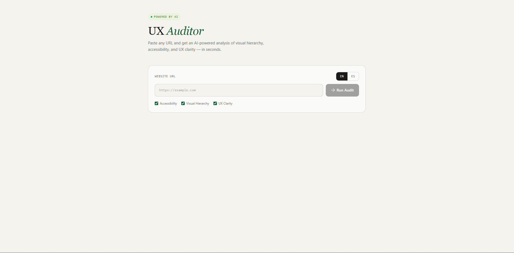

# UX Auditor

> Live site: **[ux-auditor-chi.vercel.app](https://ux-auditor-chi.vercel.app)**

An AI-powered UX analysis tool. Paste any website URL and get a structured report on visual hierarchy, accessibility, and UX clarity — with a score and concrete improvement suggestions.

---

## Preview



> 💡 **Tip:** Add a screenshot named `preview.png` inside `/public`. A GIF showing the analysis in action would be even better.

---

## What it does

1. User inputs any public URL
2. The app sends it to the AI for analysis
3. Returns a scored report covering:
   - **Visual hierarchy** — layout clarity, content scanning patterns
   - **Accessibility** — contrast, semantic structure, keyboard navigation signals
   - **UX clarity** — call-to-action visibility, cognitive load, information architecture

---

## Tech stack

| Layer      | Technology                  |
|------------|-----------------------------|
| Framework  | Next.js 14 (App Router)     |
| Language   | TypeScript                  |
| Styling    | Tailwind CSS                |
| AI         | Claude API (Anthropic)      |
| Deployment | Vercel                      |

---

## Getting started

```bash
# 1. Clone the repo
git clone https://github.com/DevMathw/ux-auditor.git
cd ux-auditor

# 2. Install dependencies
npm install

# 3. Set up environment variables
cp .env.example .env.local
# Add your Anthropic API key

# 4. Run the dev server
npm run dev
```

Open [http://localhost:3000](http://localhost:3000).

---

## Environment variables

```env
ANTHROPIC_API_KEY=your_api_key_here
```

Get your API key at [console.anthropic.com](https://console.anthropic.com).

---

## Project structure

```
ux-auditor/
├── app/
│   ├── api/         # API route — handles AI request/response
│   ├── page.tsx     # Main UI — input form and report display
│   └── layout.tsx   # Root layout
└── public/          # Static assets
```

---

## Technical decisions

**Why TypeScript?** The AI response is structured JSON. Typing the report schema (`score`, `issues[]`, `suggestions[]`) catches mismatches between what the API returns and what the UI expects — especially useful when iterating on the prompt.

**Why Next.js API routes?** Keeps the Anthropic API key server-side only. No key exposure in the browser, no separate backend needed.

**Prompt design:** The system prompt instructs the model to return a JSON object with a fixed schema, which makes the frontend rendering predictable and avoids parsing fragile markdown.

---

## Limitations & next steps

- Currently analyzes based on URL metadata and publicly available information; does not render the page visually
- Planned: screenshot capture via Puppeteer for visual analysis
- Planned: export report as PDF

---

## Contact

**Mateo Garcia** — Full-stack Developer  
[mathw.dev](https://mathw.dev) · [LinkedIn](https://www.linkedin.com/in/mateo-garcia-rodriguez-933135207/)
