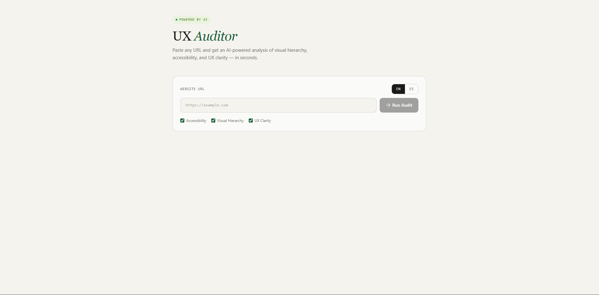

# UX Auditor

**Verifiable UX audits.** Paste a URL, get 27 automated checks — each showing
the evidence that triggered it — measured against both the page markup and the
page as a browser actually renders it, plus an AI that looks at a screenshot and
reviews the design.

🔗 **[ux-auditor-chi.vercel.app](https://ux-auditor-chi.vercel.app)** ·
📐 [How scoring works](https://ux-auditor-chi.vercel.app/scoring) ·
📡 [API docs](./docs/api.md)

[](https://github.com/DevMathw/ux-auditor/actions/workflows/ci.yml)




---

## The one idea

Most "AI audit" tools hand a URL to a model and print whatever comes back. That
produces prose that reads well, cannot be checked, and **changes between runs**.

This is built the other way around:

> **A deterministic rule engine produces the score. The model never touches it.**

Measured, before and after that change:

| | Model writes the report | This architecture |
|---|---|---|
| Same page, audited twice | 48 / 48 / **45** | **Byte-identical** |
| Evidence per issue | none | selector, snippet, measured value, WCAG criterion |
| Cost per audit | ~$0.035 | ~$0.016, or **$0** with AI off |
| Contrast, type size, tap targets | invisible | measured from the rendered page |
| If the model fails | whole audit fails | full deterministic report still returned |

Because the score is reproducible, **before/after comparison actually means
something** — the feature that is impossible when a model picks the number.

Every figure above is measured, with method, in
[`docs/measurements.md`](./docs/measurements.md).

---

## Features

- **27 deterministic checks** across accessibility, visual hierarchy and UX
  clarity — [documented publicly](https://ux-auditor-chi.vercel.app/scoring),
  generated from the rule definitions so the page cannot drift from the code
- **Real contrast ratios**, type sizes and tap targets measured from computed
  styles in a rendered browser, not guessed from HTML
- **Multimodal AI review** — the model receives a screenshot and judges what the
  markup cannot express. Every observation must quote the page or it is dropped
- **Before/after comparison** — fixed, new and still-open issues between two
  audits of the same URL
- **Confidence signal** — a client-rendered shell is reported as low confidence
  instead of being handed a confident score
- **Export** to PDF, JSON (typed `AuditResult`) and Markdown
- **Bilingual** EN/ES, including the report content
- **Three optional layers** that degrade cleanly — see below
- **It audits itself** — the landing shows a real audit of this app, generated
  by `npm run self-audit`, including what it finds wrong here
- **CI integration** — [an example GitHub Action](./examples/github-action/)
  that gates a pull request on the score
- **Dark mode**, following the system preference

---

## Architecture

```
Visitor → Next.js UI → /api/audit → runAudit()
                                        │
                       ┌────────────────┼────────────────┐
                       ▼                ▼                ▼
                 fetchPage         renderPage      content-hash
                 SSRF guard        Playwright         cache
                 1.5 MB cap     styles + screenshot
                       │                │
                       └────────┬───────┘
                                ▼
                    Deterministic engine · 27 rules
                                ▼
                 Score + findings with evidence  ← REPRODUCIBLE
                                ▼
                   AI interpretation (optional)
                   summary + quoted observations
                                ▼
                             Report
```

Full diagrams and module layout: [`docs/architecture.md`](./docs/architecture.md).

### Three layers, three failure modes

| Layer | Needs | Adds | Cost | If unavailable |
|---|---|---|---|---|
| **Markup rules** | nothing | 22 rules | $0.000 | cannot fail — this is the floor |
| **Rendered rules** | a Chromium binary | 5 rules: contrast, type size, tap targets, overflow, first screen | $0.000 | skipped and excluded from the score |
| **Interpretation** | an API key | screenshot-based design review | ~$0.016 | deterministic summary instead |

`GET /api/health` reports which layers a given deployment can actually run, so
the degradation is visible from outside rather than silent. `GET /api/usage`
(token-gated) reports what the AI layer has cost this instance.

---

## Tech stack

| Layer | Technology |
|---|---|
| Framework | Next.js 16 (App Router) |
| Language | TypeScript, strict |
| Styling | Tailwind CSS + CSS custom properties |
| Parsing | node-html-parser |
| Rendering | Playwright (`playwright-core`) |
| AI | Claude API (`claude-sonnet-5`), structured outputs, multimodal |
| Testing | Vitest + Testing Library + Playwright |
| CI | GitHub Actions |
| Deployment | Vercel |

---

## Security

The server fetches **and executes** arbitrary user-supplied pages. Two distinct
attack surfaces, both closed:

- **SSRF (HTTP)** — DNS is resolved and every returned address must be public;
  re-validated on each of up to 3 redirect hops. A domain resolving to
  `127.0.0.1` is rejected before any request is made. **35 tests** with mocked
  DNS, because a real attacker controls their own DNS
- **SSRF (browser)** — a rendered page can call `fetch()` itself, reopening the
  hole from inside. Every browser request goes through the same public-address
  check. Verified: a page attempting to exfiltrate a loopback resource lands
  **zero** requests on it
- **Sandbox** — Chrome's sandbox stays on; disabled only where the host cannot
  support it, never by default
- **CSP** — per-request nonce with `strict-dynamic` replaces
  `script-src 'unsafe-inline'`. Measured cost: **+9 ms TTFB**.
  `style-src` keeps `'unsafe-inline'` deliberately — nonces do not apply to
  `style=` attributes, and a style attribute cannot execute JavaScript
- **Prompt injection** — page content is fenced and labelled untrusted; AI
  findings are dropped unless they quote the page
- **Output escaping** — the PDF export escapes everything and renders under its
  own CSP that blocks script execution
- **Structured logging** — one JSON line per event, with URLs reduced to their
  host and any key-like field redacted; a log is hard to un-write

---

## Testing

```bash
npm test
```

**246 tests, no network, under 80 seconds.**

**Domain and infrastructure — 170 tests**

| Suite | Tests | Covers |
|---|---|---|
| `ssrf` | 35 | private ranges, IPv6, DNS rebinding, redirect chains |
| `rules` | 30 | every markup rule, scoring properties, determinism, doc coverage |
| `run-audit` | 22 | the full use case and every degradation path |
| `exporters` | 16 | JSON and Markdown output |
| `visual-rules` | 16 | visual rules on synthetic snapshots |
| `audit-cache` | 15 | keys, TTL, LRU eviction |
| `rate-limit` | 15 | windows, expiry, client identification |
| `compare` | 13 | deltas, fixed/new classification |
| `csp` | 8 | the nonce policy cannot silently regress |

**Components (Testing Library + jsdom) — 76 tests**

| Suite | Tests | Covers |
|---|---|---|
| `AuditForm` | 19 | submission, URL normalisation, area selection, loading, language |
| `FindingsList` | 19 | severity grouping, evidence disclosure, rule vs AI provenance |
| `AuditWorkspace` | 18 | idle → loading → result → error, cancellation, AbortController |
| `HistoryPanel` | 13 | listing, load, delete, **corrupt and outdated history** |
| `ExportButton` | 7 | JSON, Markdown, and PDF escaping under its own CSP |

**End-to-end (Playwright, real Chromium) — 14 tests**

The full journey — open, enter URL, audit, read findings, open evidence, export,
history — plus what only a real browser can verify: that the nonce CSP does not
block hydration, that code-split chunks load, that storage survives a reload, and
that the PDF export actually prints. `/api/audit` is intercepted so CI needs no
network and no API key.

They encode the properties the product sells: the same HTML always produces the
same report, a rule that does not apply never counts as passed, the AI never
changes the score, cancelling really aborts the request, and **every false
positive found during calibration has a test so it cannot come back**.

### Two bugs the tests found

Neither was visible by reading the code:

- **Component tests:** `AuditForm` normalises `example.com` to
  `https://example.com`, but the input was `type="url"`, whose native validation
  blocks submission before that code runs. The normalisation was dead in
  practice — a user typing a bare domain got a browser tooltip instead of an
  audit. Fixed with `noValidate`.
- **E2E:** the Cancel button did not respond to *real* clicks. React was reusing
  one DOM node for two semantically different buttons (submit → cancel), mutating
  its type and handlers in place; the reused node stopped receiving trusted
  clicks while still accepting synthetic ones — which is why jsdom passed. Fixed
  by giving each branch its own `key`.

---

## CI/CD

[`.github/workflows/ci.yml`](./.github/workflows/ci.yml) runs on every push and
pull request in two jobs: `verify` (lint → typecheck → unit tests → build →
`npm audit`) and `e2e` (build → Playwright against the production server).
The audit step fails on High/Critical only, so a moderate advisory in a
transitive dependency does not block a merge. Dependabot proposes grouped
monthly updates for npm and Actions.

---

## Performance

Measured on this hardware; method and caveats in
[`docs/measurements.md`](./docs/measurements.md).

| Metric | Before | After |
|---|---|---|
| Lighthouse Performance (desktop) | 69 | **98** |
| Accessibility / Best Practices / SEO | 100 | 100 |
| Total Blocking Time | 1,331 ms | 99 ms |
| JS bootup time | 1.5 s | **0.3 s** |

The hardware-independent number is the 80% cut in JS bootup, from code-splitting
the report UI behind `next/dynamic`.

**Mobile scores are not claimed.** Across three identical runs on this machine
Total Blocking Time ranged 846-2,528 ms; that spread is wider than most changes
worth making, and reporting a number from it would be dishonest.

---

## Getting started

```bash
git clone https://github.com/DevMathw/ux-auditor.git
cd ux-auditor
npm install
cp .env.example .env.local   # then add your Anthropic API key
npm run dev
```

Node 20.9+. The app runs without any key — you get the complete deterministic
audit, just without the interpretation layer.

```env
ANTHROPIC_API_KEY=sk-ant-...          # optional; enables the AI layer
NEXT_PUBLIC_SITE_URL=https://...      # optional; canonical URLs and sitemap
BROWSER_WS_ENDPOINT=ws://...          # optional; remote browser over CDP
PLAYWRIGHT_EXECUTABLE_PATH=/path/...  # optional; overrides browser detection
PLAYWRIGHT_NO_SANDBOX=1               # only where the host cannot sandbox
USAGE_TOKEN=...                       # optional; unlocks GET /api/usage
```

`playwright-core` ships no browser. Locally the app finds an installed Chrome or
Edge automatically. For serverless, either install `@sparticuz/chromium` or —
recommended — point `BROWSER_WS_ENDPOINT` at a hosted browser. Check
`/api/health` after deploying: it states plainly whether the visual rules are
running.

---

## Engineering decisions

Each of these was a real fork with a measured trade-off.

**Rules produce the score, not the model.** Costs a rule engine to maintain.
Buys reproducibility, evidence, a free tier that costs nothing to serve, and
makes before/after comparison possible at all.

**Rendering is optional, not required.** Costs a capability matrix and an
abstraction over three browser providers. Buys an app that works identically on
a laptop, in CI with no browser, and on serverless.

**Nonce CSP over static prerendering.** Costs 9 ms of TTFB and the loss of
static prerender. Buys the elimination of `script-src 'unsafe-inline'`, which is
the first thing a security review flags.

**`@sparticuz/chromium` as an optional peer, not a dependency.** Costs a manual
step for serverless deploys. Avoids a 50 MB penalty on every local install for a
package most users never need.

**Rules that do not apply are excluded from the score.** Without this a nearly
empty page scores well for everything it does not have — `example.com` scored 80
before, 66 after.

**AI findings are dropped without a quote.** Costs some legitimate observations.
Buys the guarantee that no AI claim reaches the report unbacked, which is the
whole difference from a wrapper.

---

## Trade-offs — what was deliberately not built

| Not built | Why |
|---|---|
| Redis for cache and rate limiting | Needs a provider account. The in-memory versions are correct for one instance and documented as cost controls, not security boundaries |
| PostgreSQL + server-side history | Same. Comparison works today on browser history; a database is the prerequisite for sharing, not for the feature itself |
| Auth, billing, API keys | Specified in full in [`docs/commercial-readiness.md`](./docs/commercial-readiness.md). Building them before the product was worth paying for would have been the wrong order |
| Multi-page crawl, drift monitoring | Real complexity — queues, concurrency, scheduling — answering demand that does not exist yet |
| Sentry | Would take an account to verify. `/api/health` and structured error logging cover the gap honestly |

---

## Limitations

- Contrast over gradients or background images is reported as **indeterminate**
  rather than guessed
- A full audit takes ~30 s, up to 60 s on a cold browser
- The `serverless` browser provider is implemented but **not verified on
  Vercel** — see [measurements.md](./docs/measurements.md#serverless-rendering)
- Rate limiting is per-instance and in-memory
- History lives in the browser; clearing site data loses it


---

## Dogfooding

The landing page shows a real audit of this app. It is generated by
`npm run self-audit`, which runs the engine against the production build and
writes the result with its date — clearly labelled as generated, never presented
as a live run or as sample data.

It scores **97/100 (17/18)** and finds real things, including from the AI layer:
*"the heading names the product, not the value"*. The meta description on this
site was 184 characters until its own tool flagged it; it is 158 now.

Rendering is skipped when auditing ourselves, because the SSRF guard blocks the
browser from reaching a local address — the guard working correctly against its
own app. The page says so.

---

## Documentation

| Document | Contents |
|---|---|
| [`docs/architecture.md`](./docs/architecture.md) | Diagrams, layering, security boundaries |
| [`docs/api.md`](./docs/api.md) | All three endpoints, errors, limits, examples |
| [`docs/measurements.md`](./docs/measurements.md) | Every number in this README, with method |
| [`docs/commercial-readiness.md`](./docs/commercial-readiness.md) | What it would take to charge for this |
| [`docs/interview-preparation.md`](./docs/interview-preparation.md) | The hard questions this project invites |
| [`examples/github-action/`](./examples/github-action/) | Gate a PR on the UX score |

---

## Roadmap

Only what is actually planned:

1. Verify the serverless browser path on a real Vercel deploy
2. Shared store (Redis) for cache and rate limiting
3. Server-side history, which unlocks shareable comparison URLs

---

## License

MIT — see [LICENSE](./LICENSE).

**Mateo Garcia** — Full-stack Developer ·
[mathw.dev](https://mathw.dev) ·
[LinkedIn](https://www.linkedin.com/in/mateo-garcia-rodriguez-933135207/)
