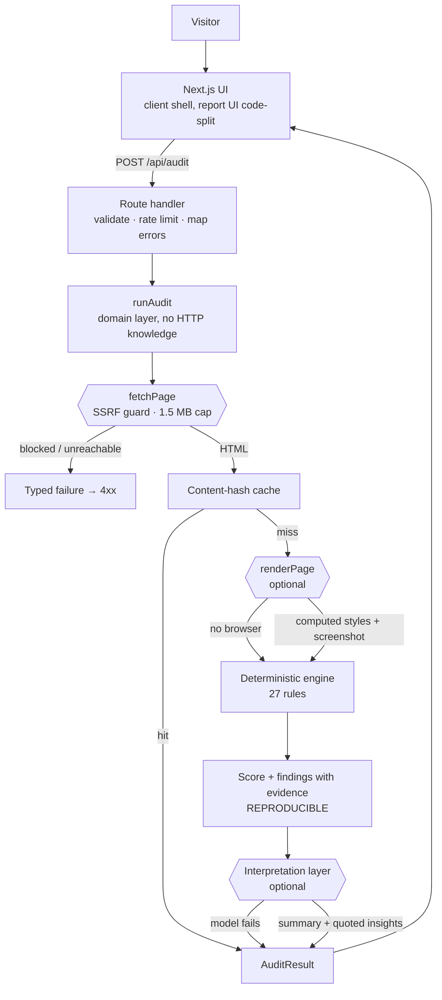
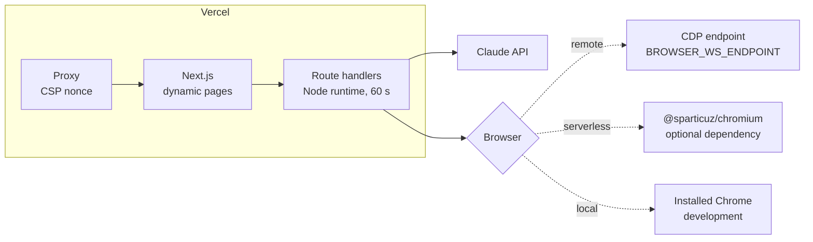

# Architecture

The whole design follows from one decision: **the score is produced by
deterministic rules, and the language model never touches it.**

Everything else — the layering, the caching, the degradation behaviour, the
comparison feature — is a consequence of that.

---

## Request flow



The two `optional` boxes are the point. Each can fail or be absent, and the
request still returns a complete, useful report.

---

## Four layers, four failure modes

| Layer | Needs | Adds | Cost | If unavailable |
|---|---|---|---|---|
| **Markup rules** | nothing | 22 rules on the served HTML | $0.000 | Cannot fail — this is the floor |
| **Rendered rules** | a Chromium binary | 5 rules: contrast, type size, tap targets, horizontal overflow, first screen | $0.000 | Rules are skipped, excluded from the score, `rendered: false` |
| **Interpretation** | `ANTHROPIC_API_KEY` | summary + quoted design observations | ~$0.016 | Deterministic summary is generated instead, `aiEnabled: false` |
| **Storage** | a writable directory | server history, share links, API keys, error log, a cache that survives restarts | $0.000 | Falls back to memory; everything works, nothing survives a restart |

`GET /api/health` reports which layers are actually up in a given deployment,
so the degradation is visible from outside rather than silent.

The pattern is the same in all four: an optional capability, resolved at
runtime, that reports what it resolved to. None of them requires an account with
an external service — the storage layer uses Node's built-in `node:sqlite`
rather than Redis or Postgres, so cloning the repository and running
`npm install` is the whole setup.

### Why the store is split into repositories

`Store` exposes four narrow repositories — audits, API keys, errors, cache —
instead of one generic key-value interface. Each has its own shape and its own
retention rule (audits prune by age, errors are a bounded ring, cache entries
expire by TTL), and a single `get(key)` would hide all of that behind an opaque
blob. It also means the SQLite schema can index what each one actually queries.

The contract is defined once in `app/lib/storage/types.ts` and the test suite
runs **the same 31 tests against both implementations**, which is the only
way the claim that they are interchangeable means anything.

### Why SQLite is not opened on Vercel

Vercel's runtime only allows writes to `/tmp`, which is per-instance and does
not survive. A database there would appear to persist and then silently lose
data between requests handled by different instances — worse than not having
one. So the provider detects `VERCEL` and goes straight to memory, and
`/api/health` reports `serverless_ephemeral_disk`.

This is a real, stated limitation rather than a papered-over one: to get
persistence in production the deployment needs a writable volume — a container,
a VM, or Fly/Railway-style hosting.

---

## Why rules, not a model, produce the score

Measured before the rewrite: the same page audited three times with a model
choosing the score returned **48, 48, 45**, with a different number of findings
each time.

That makes three features impossible:

- **Re-audit** — a 3-point move means nothing
- **Before/after comparison** — you cannot tell a fix from noise
- **Trust** — a number that changes on refresh is not a measurement

With a rule engine the same HTML always produces a byte-identical report. That
is what makes `app/lib/compare.ts` meaningful, and it is verified by a test that
asserts an audit with the AI layer on and off returns the same score.

The model still does real work — reading the rendered screenshot and judging
whether the design communicates — but its output is additive, marked
`source: "ai"`, and discarded if it does not quote the page.

---

## Scoring

Per category:

```
score = 100 × (1 − penalties incurred / penalties possible on this page)
```

Each rule declares a `maxPenalty` and an `applies()` predicate. Rules that do
not apply are excluded from **both** sides of that fraction.

This matters more than it looks. Without it, a nearly empty page scores well for
everything it does not have — no images means "all images have alt text" passes.
That bug was real: `example.com` scored 80 before applicability was introduced,
66 after.

Calibration anchor: `w3.org/WAI`, published by the body that writes WCAG, scores
100 with all 27 rules active.

---

## Module layout

```
app/
├── page.tsx, scoring/page.tsx     Presentation (Server Components)
├── a/[shareId]/page.tsx           Presentation: read-only shared report
├── components/                    Presentation (Client Components)
│   └── AuditWorkspace             the only stateful shell; report UI is code-split
├── api/
│   ├── audit/route.ts             HTTP: validate, rate limit, map errors to status
│   ├── explain/route.ts           HTTP
│   ├── audits/                    HTTP: session history, deletion, share links
│   ├── keys/                      HTTP: API key issue, list, revoke (operator)
│   ├── errors/                    HTTP: recent errors (operator)
│   └── health/route.ts            HTTP: capability report
└── lib/
    ├── runAudit.ts                Domain: the use case, dependency-injected
    ├── rules/                     Domain: the 27 checks + their docs
    ├── compare.ts                 Domain: before/after diff
    ├── exporters.ts               Domain: JSON / Markdown serialisation
    ├── fetchPage.ts               Infrastructure: SSRF-safe HTTP
    ├── render.ts                  Infrastructure: Playwright
    ├── browserProvider.ts         Infrastructure: which Chromium, and how
    ├── auditCache.ts              Infrastructure: content-hash cache, over the store
    ├── rateLimit.ts               Infrastructure: fixed-window limiter
    ├── usage.ts                   Infrastructure: AI cost accounting
    ├── session.ts                 Infrastructure: anonymous session cookie
    ├── apiKeys.ts                 Infrastructure: key auth and quota
    ├── operatorAuth.ts            Infrastructure: ADMIN_TOKEN, timing-safe
    └── storage/                   Infrastructure: the store
        ├── types.ts               the contract, and the privacy policy in prose
        ├── memory.ts              in-process implementation
        ├── sqlite.ts              node:sqlite implementation + migrations
        └── index.ts               provider resolution; never throws
```

`runAudit()` takes its external dependencies as an argument, so the integration
tests exercise the real orchestration — including every degradation path —
without network, browser or model.

---

## Security boundaries

The server fetches and **executes** arbitrary user-supplied pages. Two distinct
attack surfaces:

**HTTP fetch.** `isPublicTarget()` resolves DNS and requires every returned
address to be public, re-validated on each of up to 3 redirect hops. A domain
that resolves to `127.0.0.1` is rejected before any request is made. 35 tests
cover this with mocked DNS, because a real attacker controls their own DNS.

**Rendered page.** The browser runs third-party JavaScript, which reopens the
same hole from inside. Every browser request is routed through the *same*
`isPublicTarget()` check. Verified: a page that tries to `fetch()` a loopback
resource lands zero requests on it. Chrome's sandbox stays on unless the host
cannot support it.

**Prompt injection.** Page content is fenced and labelled untrusted in the
prompt, and AI findings are dropped unless they quote the page — so an injected
instruction cannot become a finding without also being visible as a quote.

**CSP.** A per-request nonce with `strict-dynamic` replaces
`script-src 'unsafe-inline'`. This requires dynamic rendering, which costs a
measured 9 ms of TTFB. `style-src` keeps `'unsafe-inline'` because nonces do not
apply to `style=` attributes and a style attribute cannot execute JavaScript.

---

## Deployment



`browserProvider.ts` resolves those three in order. The honest state of this is
documented in [measurements.md](./measurements.md#serverless-rendering) —
including what is verified and what is not.
